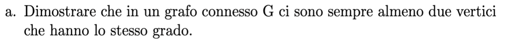
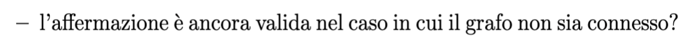
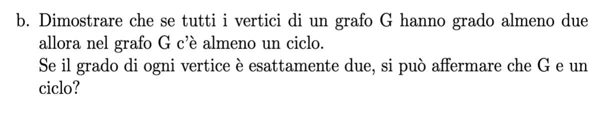
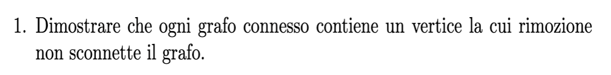
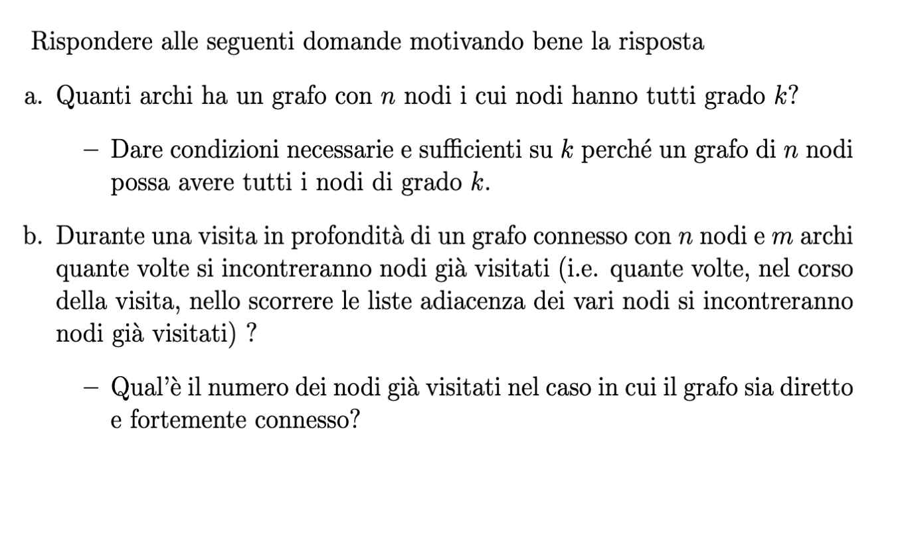
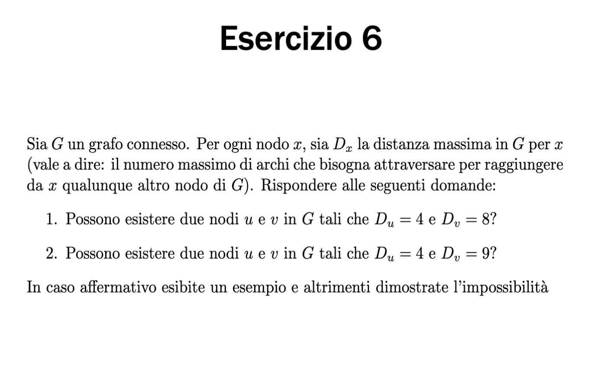
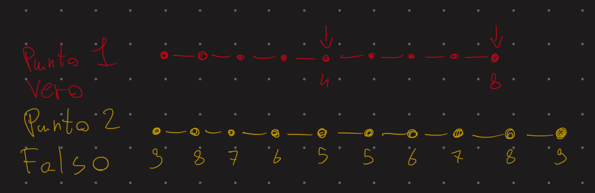

#
# es 3 a

    prendiamo in considerazione i gradi di un grafo non orientato che possono variare da 0 a n-1, il grafo essendo connesso varia da 1 a n-1 perche nessun connesso nessun nodo puo avere grado 0 quindi quando vado a vedere i gradi di tutti i nodi al caso pessimo arrivo 
    all'penultimo dove ogni nodo ha un grado diverso e l'ultimo sicuramente avra un grado come uno dei precedenti

    il principio funziona anche se il grafo e sconnesso perche i possibili ordini 
    variano da 0 a n-2 perche essendoci almeno un nodo sconnesso nessun nodo ha 
    grado n-1
#
# es 3 b

    da fare 
#    
# es 4

    se il grafo ha un nodo di grado 1 posso rimuovere quello e il grafo non si sconnette rimangono da dimostrare tutti i casi in cui non abbiamo nodi con grado 1. se non abbiamo nodi di grado 1 allora sono di grado 2 quindi sicuramente abbiamo dei cicli.
    costruiamo un albero di ricerca con la DFS partendo da un nodo casuale, questo albero sara costituito da tutti i nodi del grafo e un sottoinsieme di archi del grafo, quindi questo percorso rappresenterà un percorso per connettere tutto il grafo. Se eliminassi una foglia (di cui ne ho almeno 2) allora sicuramente non sconneterò il grafo perché avrò un nuovo percorso (di nodi n-1) ancora connesso. Dato che un albero ha almeno 2 foglie allora l'albero DFS avrà almeno 2 foglie ed entrambe posso sconnetterle quindi ho almeno 2 nodi che posso sconnettere. Un albero ha almeno 2 foglie poichè un nodo radice può essere di grado 1 (quindi foglia) e perciò dato che l'albero continuerà per concludersi senza cicli deve incontrare almeno un altra foglia.
    Oppure se la radice è di almeno grado 2 allora avrò almeno 2 nodi figli della radice e gli archi da questi figli possono andare da altri nodi che saranno di grado 1 (quindi foglie) oppure di grado 2 e continueranno fino ad incontrare una foglia o un arco andrà in un nodo già creato in precedenza formando un ciclo.

#
# es 5

# (a)
    un grafo con n=nNodi nodi tutti di grado k=ordNodi avrà nArchi = (nNodi*ordNodi)/2 

    un grafo con tutti i nodi di grado k=ordNodi | ordNodi = (nArchi*2)/nNodi

# (b)
    da rivedere bene 

## es 6

## risposta

# sia G un grafo non orientato, dimostrare che se uno tra G e G_complementare è connesso 

    caso 1 se G e connesso dimostrato perche G stesso e connesso 
    caso 2 se G ha un solo nodo sconnesso da tutto il resto del grafo , 
        nel grafo complementare quel nodo sara connesso a tuttio gli altri 
        e g_complementare sarà connesso
    caso 3 se G ha due sottografi sconnessi nel grafo complementare ogni punto di un 
        sottografo sarà connesso a tutti gli altri dell altro sottografo stessa cosa
         nell'altro senso e tutto sarà connesso 