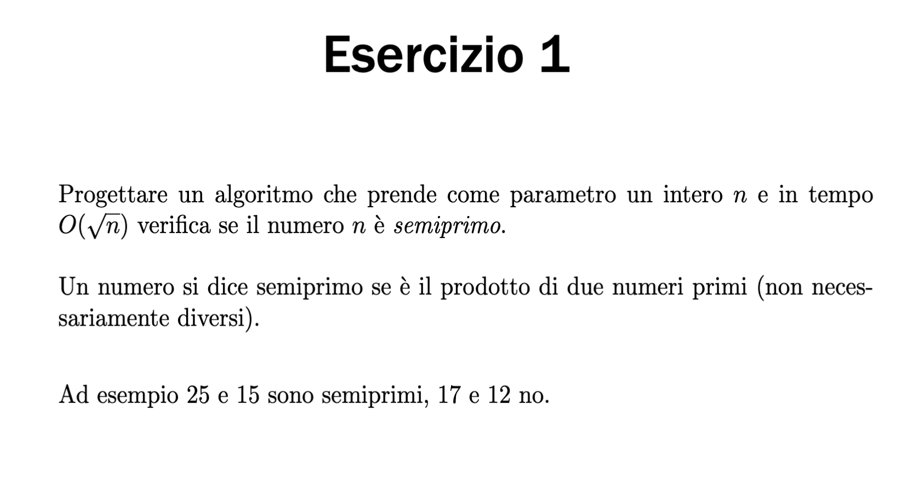

```python
from math import sqrt

def isPrime(n:int)->bool:
    for num in range(2, round(sqrt(n))+1):
        if n % num == 0:
            return False
    return True


def generatePrime(n:int)->list[int]:
    primeList = []
    for num in range(2, round(sqrt(n))+1):
        if isPrime(num):
            primeList.append(num)
    return primeList
```
#
# es 3 a
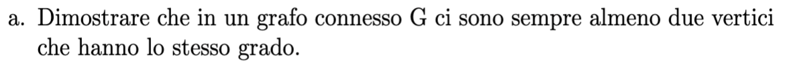

    prendiamo in considerazione i gradi di un grafo non orientato che possono variare da 0 a n-1, il grafo essendo connesso varia da 1 a n-1 perche nessun connesso nessun nodo puo avere grado 0 quindi quando vado a vedere i gradi di tutti i nodi al caso pessimo arrivo 
    all'penultimo dove ogni nodo ha un grado diverso e l'ultimo sicuramente avra un grado come uno dei precedenti

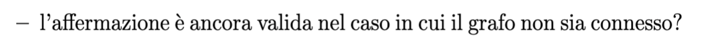

    il principio funziona anche se il grafo e sconnesso perche i possibili ordini 
    variano da 0 a n-2 perche essendoci almeno un nodo sconnesso nessun nodo ha 
    grado n-1
#
# es 3 b
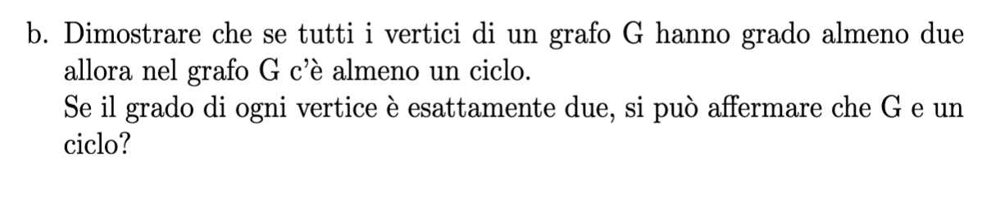

    da fare 
#    
# es 4
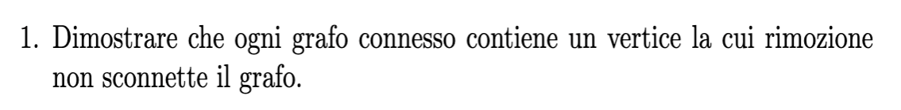


    Se il grafo ha un nodo di grado 1 posso rimuovere quello e il grafo non si sconnette rimangono da dimostrare tutti i casi in cui non abbiamo nodi con grado 1. se non abbiamo nodi di grado 1 allora il grado minimo é >= 2 quindi sicuramente abbiamo dei cicli.
    A questo punto costruiamo un albero di ricerca con la DFS partendo da un nodo casuale, questo albero sara costituito da tutti i nodi del grafo e un sottoinsieme di archi del grafo, quindi su questo albero dati due nodi possiamo trovare un percorso che li connette usando solo gli archi dell'albero. Eliminando una foglia dell'albero (di cui ne ho almeno 2) sicuramente non sconneterò il grafo perché avrò un nuovo albero (di n-1 nodi) ancora connesso.
    Dato che un albero ha almeno 2 foglie (come gia dimostrato) allora l'albero DFS avrà almeno 2 nodi che possono essere tolti senza sconnettere il grafo.

#
# es 5


# (a)
    un grafo con n=nNodi nodi tutti di grado k=ordNodi avrà nArchi = (nNodi*ordNodi)/2 

    un grafo con tutti i nodi di grado k=ordNodi | ordNodi = (nArchi*2)/nNodi

# (b)
    da rivedere bene 

## es 6

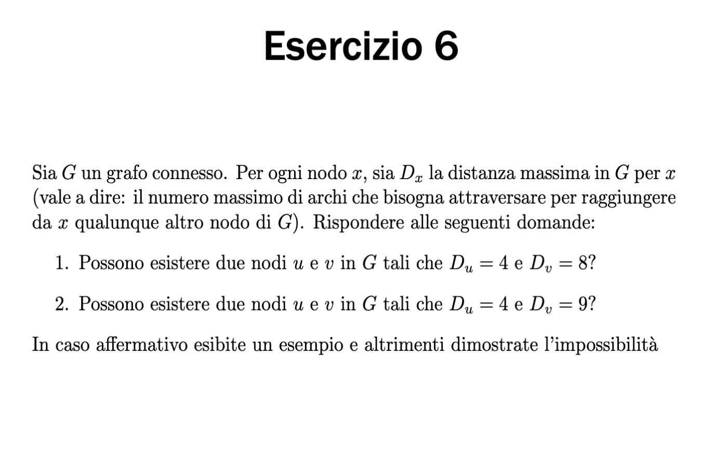
## risposta
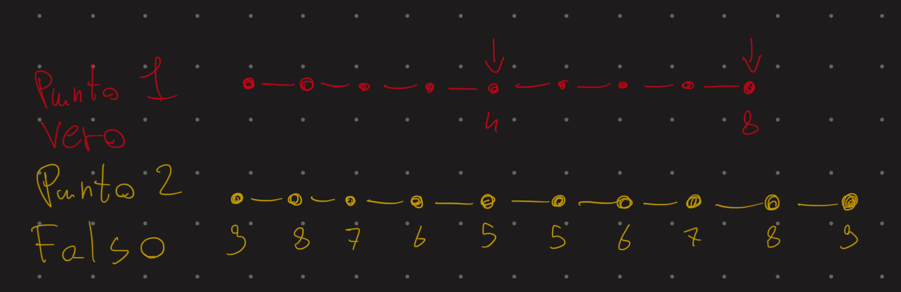

# es 11

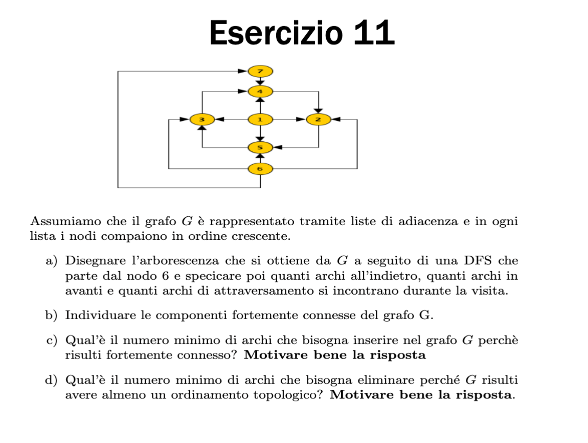
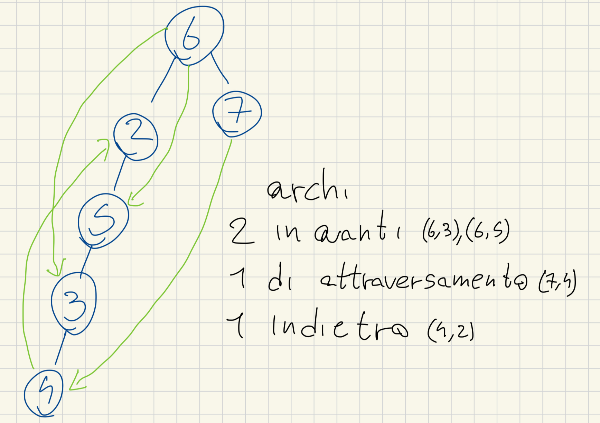

    (B) le componenti fortemente connesse sono : (2,3,4,5),(1),(7),(6)
    (C) basta aggiungere due archi che sono ad esmpio (2,6),(2,1), entrambi gli archi devono partire dalla componente fortemente connessa maggiore e arrivare ai nodi che non avevano archi entranti
    (D) un grafo per avere un ordinamento topologico non deve avere cicli, visto che il nostro grafo ha un solo ciclo ci basta togliere un solo arco per fre in modo che non ne abbia

# es 12

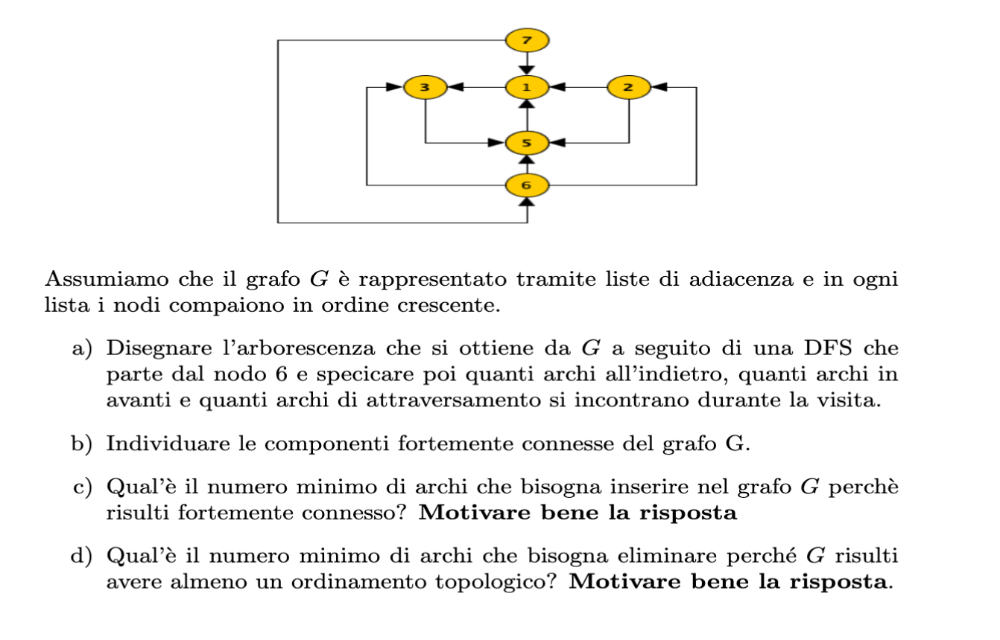
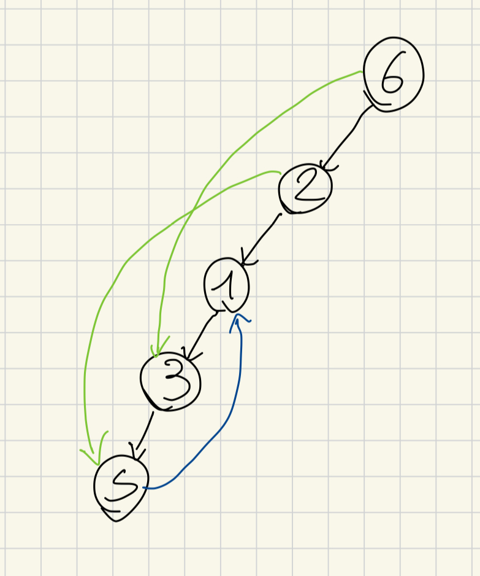

    (A) l'aborescenza radicata in 6 ha 2 archi in avanti e uno in indietro
    (B) ha 4 componenti fortemente connesse (1,3,5),(2),(6),(7)
    (C) basta un solo arco dall' 1 al 7
    (D)  un grafo per avere un ordinamento topologico non deve avere cicli, visto che il nostro grafo ha un solo ciclo ci basta togliere un solo arco per fre in modo che non ne abbia
