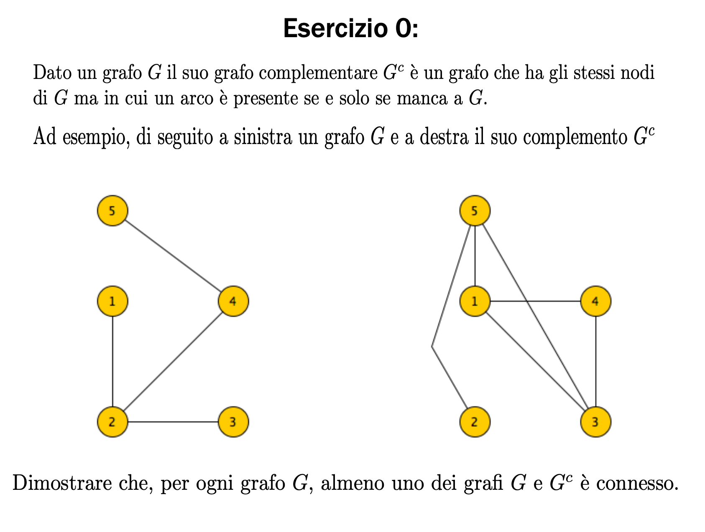
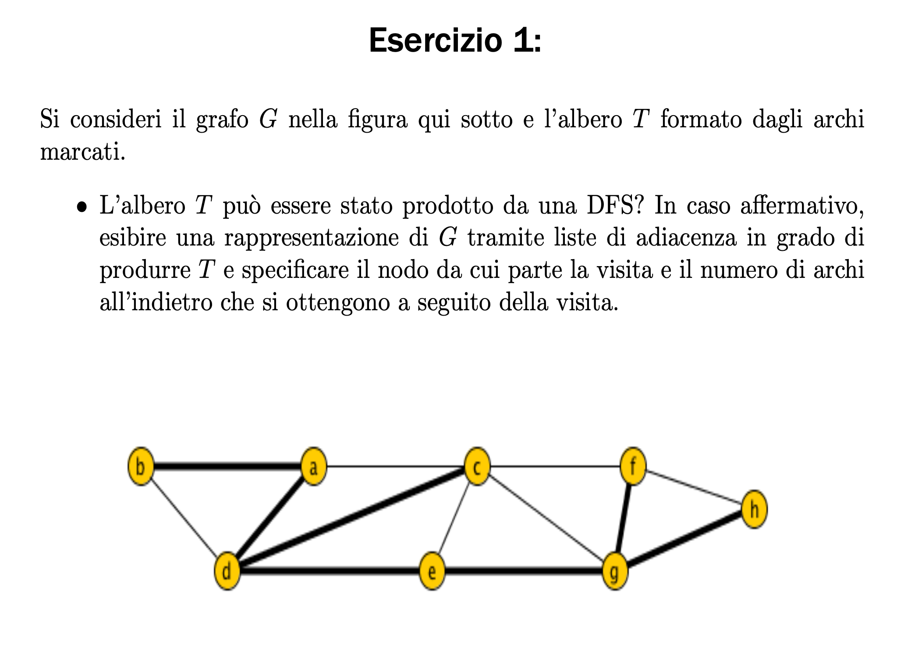
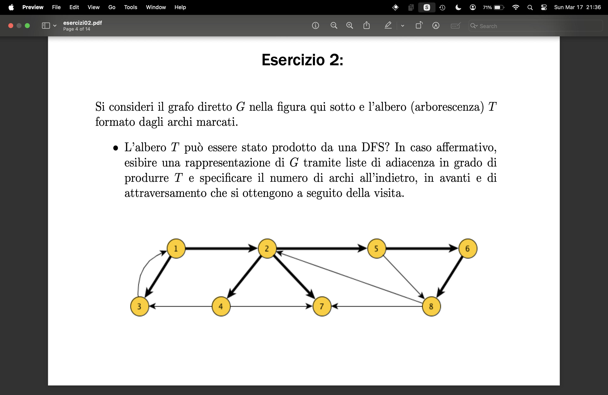

1. se G e connesso dimostrato perche G stesso e connesso 
    
1. se G ha un solo nodo sconnesso da tutto il resto del grafo , nel grafo complementare quel nodo sara connesso a tutti gli altri e quindi g_complementare sarà connesso

1. se G ha due sottografi sconnessi nel grafo complementare ogni punto di un sottografo sarà connesso a tutti gli altri dell altro sottografo stessa cosa nell'altro senso e tutto sarà connesso 

#




    affinche un albero possa essere costruito da una DFS su un grafo G
    l'albero non deve avere diramazioni su pezzi di grafo che erano cicli 




    l'albero puo essere prodotto da una DFS partendo dal nodo numero 1 con questa lista di adiacenza:
    ```python
    {
        1 : [3,2],
        2 : [7,5,4],
        3 : [1],
        4 : [7,3],
        5 : [6,8],
        6 : [8],
        7 : [],
        8 : [2,7]
    }
    ```
    archi in avanti 
    archi all'indietro 1
    archi di attraversamento

